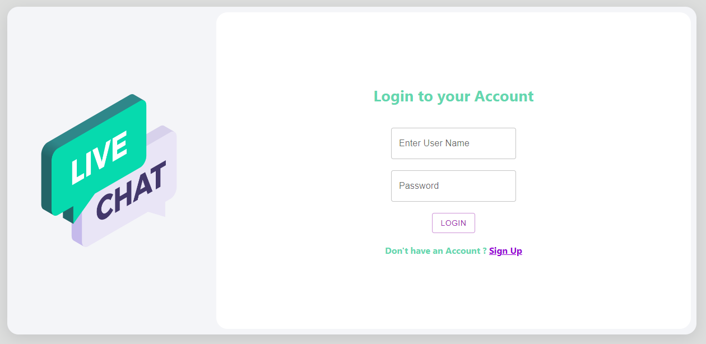
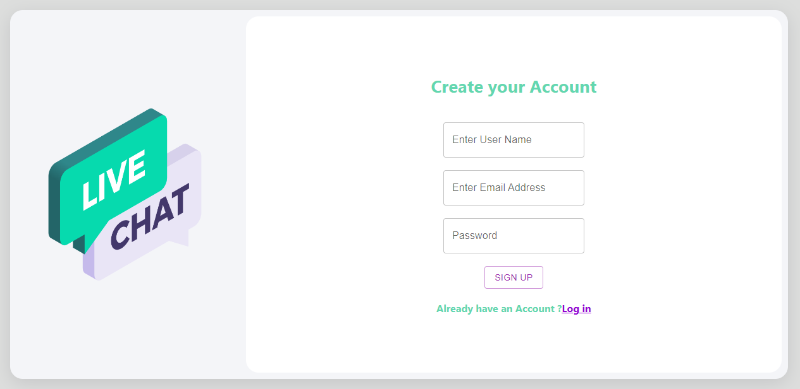
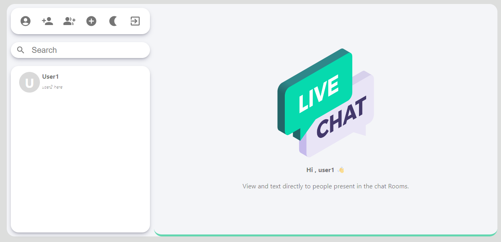
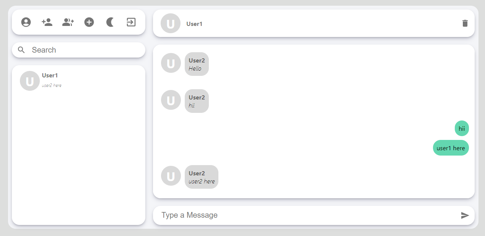
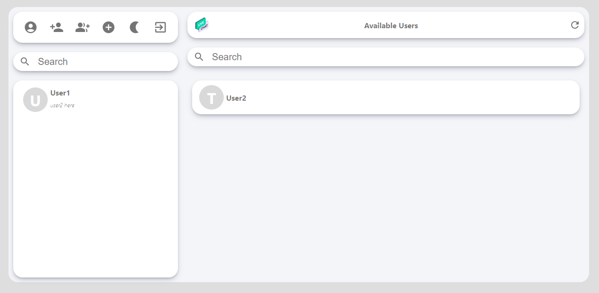
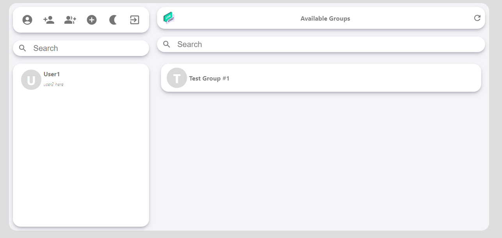
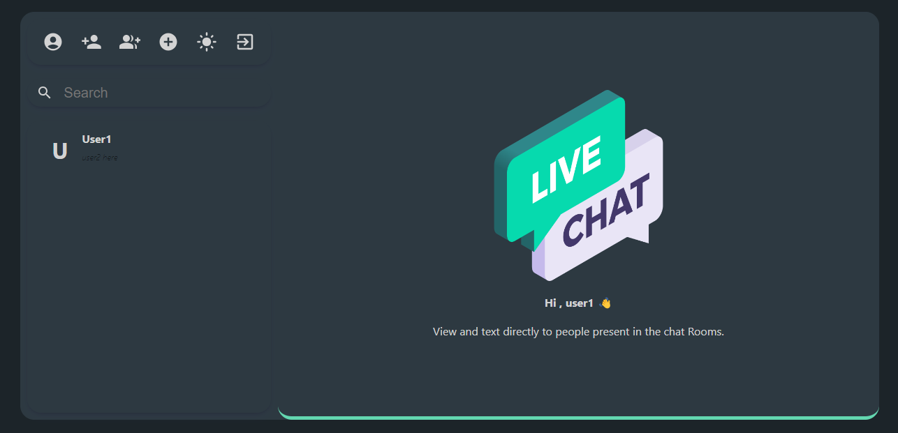

# Live Chat App

## Table of Contents
- [About The Project](#about-the-project)
- [Features](#features)
- [Tech Stack](#tech-stack)
- [Getting Started](#getting-started)
- [Screenshots](#screenshots)
- [Live Demo](#live-demo)
- [Challenges and Solutions](#challenges-and-solutions)
- [Roadmap](#roadmap)
- [Contributing](#contributing)
- [Contact](#contact)
- [Acknowledgments](#acknowledgments)

## About The Project

The Live Chat App is a real-time communication platform that allows users to engage in one-to-one and group chats. It facilitates seamless collaboration and information sharing, empowering users with an efficient and interactive chat experience. The application is built with the MERN stack, providing a robust and scalable solution.

## Features

- Real-time one-to-one and group chat functionality
- Create and join custom chat rooms for specific discussions
- Toggle between light and dark themes for a personalized UI
- Automatic backup of chat conversations to ensure data persistence
- View available groups and online users for easy connections
- Secure authentication and authorization mechanisms

## Tech Stack

- Front-end: React.js, Redux, Material UI, Framer Motion
- Back-end: Node.js, Express.js, Socket.IO
- Database: MongoDB
- Version Control: Git

## Getting Started

## Screenshots

## Live Demo
You can access the live demo of the Bookiee web application [here]().

## Challenges and Solutions

Challenges that I have faced and how i tackled them:

1. Real-Time Communication
   - Solution: Implemented real-time bidirectional communication using Socket.IO.

2. State Management
   - Solution: Utilized Redux for efficient state management.

3. Security
   - Solution: Implemented robust authentication and authorization using JSON Web Tokens (JWT).

4. User Experience
   - Solution: Improved the user experience through UI/UX best practices.

## Roadmap

- Enhance user profiles and settings
- Implement message encryption for added security
- Introduce multimedia file sharing capabilities
- Optimize performance and add more features based on user feedback

## Contributing

Contributions are welcome! Fork the repository and create a pull request for review.

## Contact

For any queries or support, please feel free to contact us at [vikaschhonkar1@gmail.com](mailto:vikaschhonkar1@gmail.com).

## Acknowledgments

We would like to express our gratitude to the open-source community and the developers of the technologies and libraries used in this project. Their valuable contributions have played a significant role in making the Live Chat App possible.
